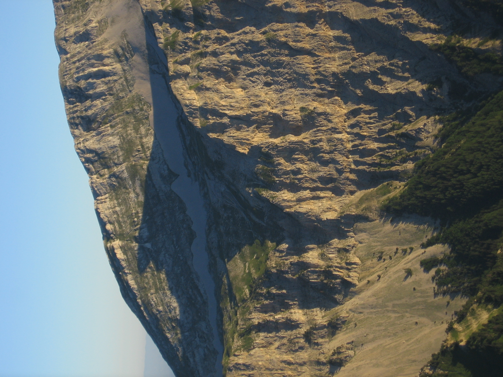
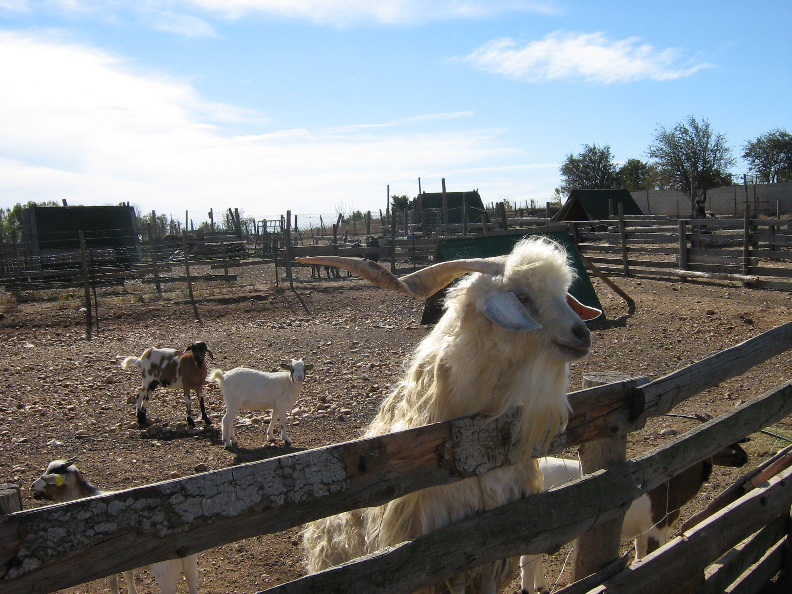
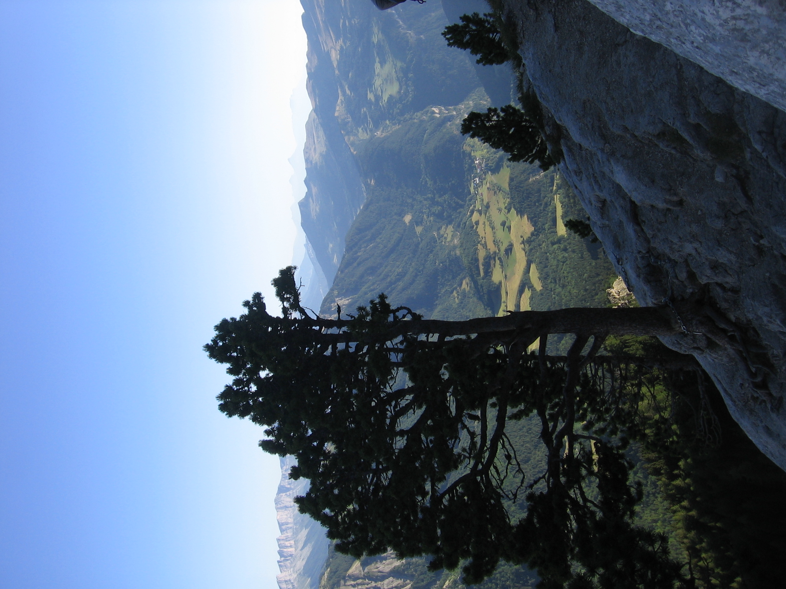
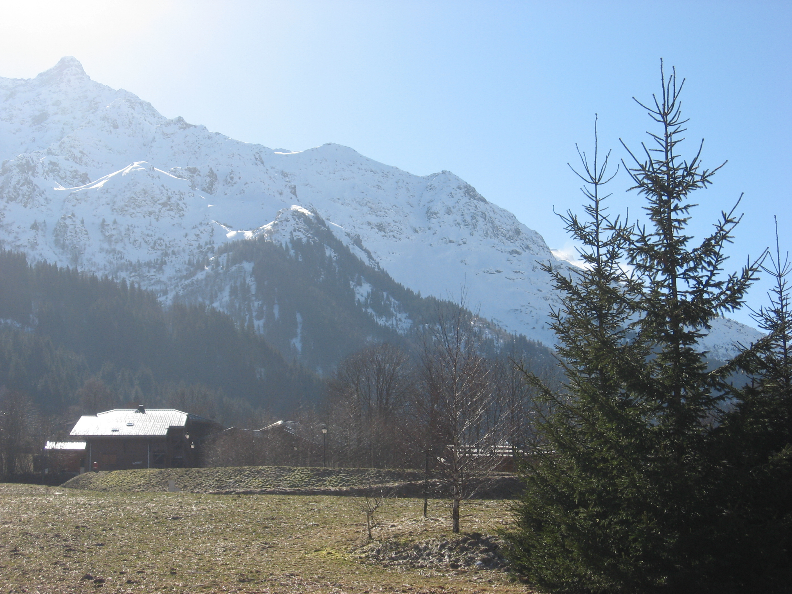

# Image Search Engine

## What you built? 

I built a basic image search program. Given a dataset of images, it is able to index the dataset (i.e, extract data from the images and categorize them based on similarity). Then, if a user gives it an image, it spits out images from the dataset that are similar to it. 

For example, the "dataset" folder contains a number of vacation photos. I passed in the following image (also from the "dataset" folder): 

.

The program then returned the following images that it found most similar to the one above (including the same image, given that it was taken from the same dataset): 

.
.
.
.

Not perfect, but at least 3/4 have mountains and a blue sky.

To build an index.csv file (which means indexing a dataset of images and writing the results into index.csv), run the following command-line argument: 

`python index.py --dataset [path to dataset directory] --index index.csv`

So to run the indexer using the example dataset provided, simply run: 

`python index.py --dataset dataset --index index.csv`

To run an actual search, run the following argument: 

`python search.py --index index.csv --query [path to query image file] --result-path [path to dataset directory]`

So if I wanted to search for images similar to "201100.jpg" in the "dataset" folder, I could run:

`python search.py --index index.csv --query dataset/108100.png --result-path dataset`

## Who Did What?

I worked on this project by myself

## What you learned

The project worked overall after a bit of debugging (a few portions of the tutorial I followed had deprecated). It works surprisingly well, though of course it's not sophisticated enough to be anyway near perfect.

I learned a lot about some of the foundational work needed for computer vision-related programs; in particular, how to break images into chunks, extract relevant information, and store it. Doing image search itself is easy, so long as you have relevant information on the image you're querying and the database of images you're using to find those similar images. The hard part is determining what information to extract and how to extract it. This applies to all sorts of things beyond image search, whether it's image classification, enhancement, or other related functions. 

Since I'm considering making a platform that can help artists sell their work online, image processing/computer vision will be a crucial component (for example, maybe I want to implement functionality that can enhance product images of the artists' work to help them sell better). I think this project helped a lot in giving me at least a vague sense of how I might approach this and other potential solutions.

## Authors

Brandon Feng

## Acknowledgments

https://www.pyimagesearch.com/2014/12/01/complete-guide-building-image-search-engine-python-opencv/
